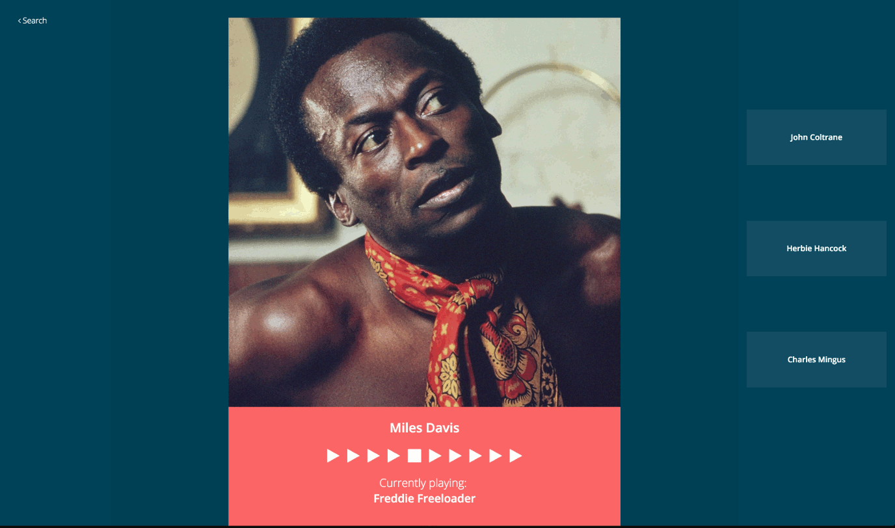

# Have You Heard?
Web application built using only client-side technologies, allowing a user to search for an artist and then they're presented with 10 preview tracks from the artist as well as links to 3 related artists. Once a related artist is selected they're presented with 10 preview tracks from that artist as well as links to 3 artists related to them. Provides endless discovery of new artists.

  

Built using:
* HTML
* CSS
* JavaScript
* jQuery
* Spotify API
